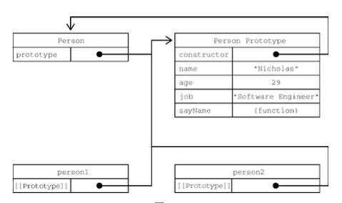

使用Object构造函数和对象字面量可以方便地创建对象，但是也有不足：创建具有同样接口的多个对象需要重复编写很多代码。
ES6开始正式支持类和继承。类仅仅是封装了构造函数加原型继承的语法糖而已。

### 工厂模式
```javascript
function createPerson(name, age, job) {
    let o = new Object();
    o.name = name;
    o.age = age;
    o.job = job;
    o.sayName = function() {
        console.log(this.name);
    };
    return o;
}
```
这种工厂模式虽然可以解决创建多个类似对象的问题，到那时没有解决对象标识问题（新创建的对象是什么类型）。

###构造函数模式
可以自定义构造函数
```javascript
function Person(name, age, job) {
    this.name = name;
    this.age = age;
    this.job = job;
    this.sayName = function() {
        console.log(this.name);
    };
}
let person1 = new Person("Nicholas", 29, "Software Engineer");
let person2 = createPerson("Greg", 27, "Doctor");
```
Person()构造函数代替类createPerson()工厂函数。实际上Person()内部代码跟createPerson()基本一样，只是如下区别：
* 没有显式创建对象
* 属性和方法直接赋值给this
* 没有return

按照惯例，构造函数名首字母都是大写。要创建Person实例，要使用new操作符。以这种方式调用构造函数会执行如下操作。
   1. 在内存中创建一个新对象
   2. 这个新对象内部的\[[Prototype]]特性被赋值为构造函数的prototype属性
   3. 构造函数内部的this被赋值为这个新对象
   4. 执行构造函数内部的代码（给新对象添加属性）
   5. 如果构造函数返回非空对象，则返回该对象；否则返回刚创建的对象。

用构造函数创建的实例都有一个constuctor属性指向他们的构造函数。

**构造函数的问题**
构造函数的主要问题在于，其定义的方法会在每个实例上都创建一遍。对于前面的例子而言，person1和person2都有名为sayName()的方法，但这两个方法不是同一个Function实例。

因为都是做一样的事情，没必要定义两个函数。况且this对象还可以吧函数与对象的绑定推出到运行时。
要解决这个问题，可以把函数定义转移到构造函数外部。
```javascript
function Person(name, age, job){
    this.name = name;
    this.age = age;
    this.job = job;
    this.sayName = sayName;
}
function sayName() {
    console.log(this.name);
}
```

### 原型模式
每个函数都会创建一个prototype属性，是一个对象，包含应该由特定引用类型的实例共享的属性和方法。new操作符做的事情有一项就是把新对象的\[[Prototype]]特性指向构造函数的prototype属性。这样，所有实例就可以共享构造函数的prototype所包含的属性和方法了。
```javascript
function Person() {}
Person.prototype.name = "Nicholas";
Person.prototype.age = 29;
Person.prototype.job = "Software Engineer";
Person.prototype.sayName = function() {
    console.log(this.name);
};
let person1 = new Person();
person1.sayName(); // "Nicholas"
let person2 = new Person();
person2.sayName(); // "Nicholas"
console.log(person1.sayName == person2.sayName); // true
```
这里，所有的属性和sayName()方法都直接添加到了Person的prototupe属性上，构造函数中什么也没有。这种原型模式定义的属性和方法是由所有实例共享的。

**理解原型**
无论何时，只要创建一个函数，就会为这个函数创建一个prototype属性（指向原型对象）。默认情况下，所有原型对象都有一个constructor属性指回与之关联的构造函数。对前面的例子而言，Person.prototpye.constructor指向Person。

每次调用构造函数创建一个新实例，这个实例内部\[[Prototype]]指针就会被赋值为构造函数的原型对象。脚本中没有访问这个\[[Prototype]]特性的标准方式，但Firefox，Safari和Chrome会在每个对象上保留__proto__属性，可以访问对象的原型。

**一句话，每个构造函数都有一个prototype属性指向它的原型对象，原型对象又有一个constructor属性指回构造函数，构造函数创建的每个实例都有一个__proto__属性指向构造函数的原型对象**


可以使用isPrototypeOf()方法确定一个对象是不是另一个对象的原型。
ES6有一个方法Object.getPrototypeOf()，返回参数内部特性\[[Prototype]]的值。
```javascript
console.log(Object.getPrototypeOf(person1) == Person.prototype); // true
```
还有一个方法Object.setPrototypeOf()，可以用来设置一个对象的原型。
为了避免使用Object.setPrototypeOf()可能造成的性能下滑，可以使用Object.create()创建一个新对象，把新对象的\[[Prototype]]特性设置为想要的原型对象。

**原型层级**
在日通过对象访问属性时，会按照这个属性的名称开始搜索，先是实例本身，到实例的原型对象，到原型对象的原型对象，直到找到。
如果在实力上添加了一个与原型对象中同名的属性，那就会在实例中创建这个属性。这个属性会遮住原型对象上的属性。

继承自Object的hasOwnProperty()方法可以检测一个属性是在实例上还是在原型对象上。

**原型和in操作符**
有两种方式使用in操作符：单独使用和在for-in中使用。在单独使用时，in操作符回在可已通过对象访问指定属性时返回true，无论属性是在实例还是原型上。只要in操作符返回true而hasOwnProperty()返回false，就可以确定属性是原型上的属性。

在for-in循环中使用in操作符时，可以通过对象访问且可以被枚举的属性都会返回，包括实例属性和原型属性。

Object.keys()列出一个对象上所有可枚举的实例属性，Object.getOwnPropertyNames()列出所有实例属性，无论是否可枚举。注意，都是实例属性。

**对象迭代**
Object.values()接收一个对象，返回对象值的数组
Object.entries()接收一个对象，返回键值对数组

**其他原型语法**
直接痛哟一个包含所有属性和方法的对象字面量来重写原型成为了一种常见的做法
```javascript
function Person() {}

Person.prototype = {
    name: "Nicholas",
    age: 29,
    job: "Software Engineer",
    sayName() {
        console.log(this.name);
    },
    // constructor: Person
};
```
在创建函数时，也会创建它的prototype对象并自动给这个原型的constructo属性赋值。上面这种写法完全覆盖了，因此constructor变成了Object()。如果手动新建一个constructor属性赋值位Person可以解决，但是这个constructor属性时\[[Enumerable]]为true的，原生的constructor默认是不可枚举的。可以通过Object.defineProperty()来定义不可枚举的属性。

**原生对象原型**
原型模式之所以重要，不仅体现在自定义类型上，更因为它也是实现所有原生引用类型的模式。所有原生引用类型的构造函数都在原型对象上定义了实例方法。比如，Array.prototype上定义了sort()和reverse()方法，String.prototype上定义了substring()和charAt()方法。

**原型的问题**
首先它弱化了想构造函数传递初始化参数的能力，会导致所有实例more嗯都取得相同的属性值。这还不是最大的问题，最大的问题源自它的共享特性。

